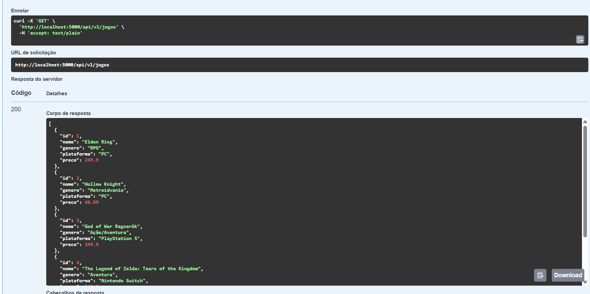
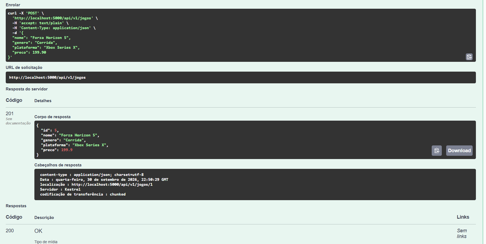
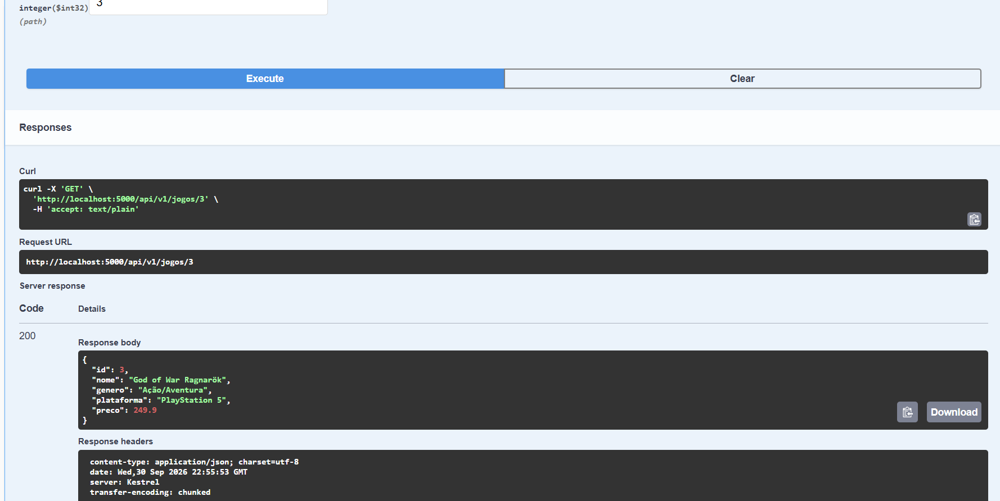
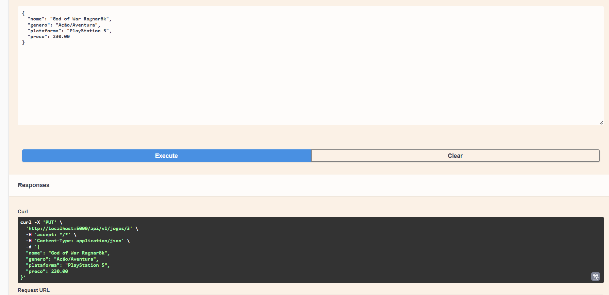
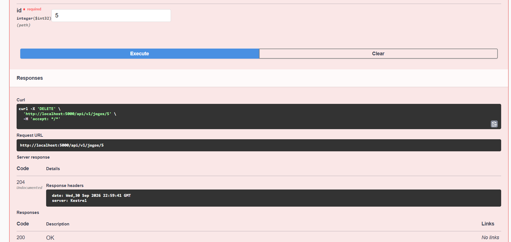
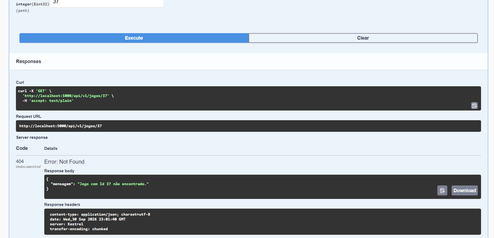

# API Catálogo de Jogos

## Integrantes

| Nome | RM |
|---|---|
| Nicolas Borges | RM556617 |
| Gustavo Atanazio | RM559098 |
| Gustavo Coelho | RM556289 |
| Dayana Quispe | RM558023 |
| Matheus Vinícius | RM555177 |

## Contexto do projeto

O **Catálogo de Jogos** é uma API RESTful para cadastrar e gerenciar uma biblioteca de jogos (nome, gênero, plataforma e preço).

- **Problema que resolve:** jogadores e lojas pequenas costumam controlar seus jogos em planilhas ou anotações soltas, o que dificulta consultar, atualizar e manter os dados organizados. A API centraliza essas informações em um banco de dados e expõe operações padronizadas para qualquer aplicação (site, app mobile, etc.) consumir.
- **Para quem é destinado:** colecionadores e jogadores que querem organizar sua biblioteca, e desenvolvedores de front-end que precisam de um back-end simples para um catálogo de jogos.

## Tecnologias

- C# / ASP.NET Core (.NET 10)
- Entity Framework Core 10
- Swagger (Swashbuckle) para documentação e testes

## Banco de dados

**SQLite** — o arquivo `catalogo.db` é criado automaticamente na pasta do projeto na primeira execução (não precisa instalar nada).

## Como rodar localmente

**Pré-requisito:** [.NET 10 SDK](https://dotnet.microsoft.com/download) instalado (`dotnet --version` deve mostrar 10.x).

```bash
git clone https://github.com/NicolasABorges/API_Catalogodejogos.git
cd API_Catalogodejogos
dotnet restore
dotnet run
```

> Ao iniciar, a aplicação aplica a migration automaticamente e cria o banco. Não é necessário rodar nenhum comando do EF manualmente.

Depois acesse o Swagger: **http://localhost:5000/swagger**

## Migrations (EF Core)

A migration inicial está em `Migrations/20260930120000_InitialCreate.cs` e cria a tabela `Jogos` (Id, Nome, Genero, Plataforma, Preco).

Comandos úteis (requer a ferramenta `dotnet-ef`):

```bash
dotnet tool install --global dotnet-ef        # instala a ferramenta (uma vez)
dotnet ef migrations add NomeDaMigration      # cria uma nova migration após alterar o model
dotnet ef database update                     # aplica as migrations no banco manualmente
```

## Versionamento

A API é versionada na URL: todas as rotas começam com `/api/v1/`. Uma futura versão incompatível poderia ser publicada em `/api/v2/` sem quebrar os clientes da v1.

## Endpoints

| Método | Rota | Descrição | Status de sucesso | Status de erro |
|---|---|---|---|---|
| GET | `/api/v1/jogos` | Lista todos os jogos | 200 | - |
| GET | `/api/v1/jogos/{id}` | Busca um jogo pelo id | 200 | 404 |
| POST | `/api/v1/jogos` | Cria um jogo | 201 | 400 |
| PUT | `/api/v1/jogos/{id}` | Atualiza um jogo | 204 | 400, 404 |
| DELETE | `/api/v1/jogos/{id}` | Remove um jogo | 204 | 404 |

Erros inesperados retornam 500 em formato ProblemDetails.

### Exemplo de corpo (POST / PUT)

```json
{
  "nome": "Elden Ring",
  "genero": "RPG",
  "plataforma": "PC",
  "preco": 249.90
}
```

Regras de validação: `nome` (2 a 100 caracteres), `genero` e `plataforma` (obrigatórios, até 50 caracteres) e `preco` entre 0 e 10000. Dados inválidos retornam **400**.

## Evidências de teste (Swagger)

### GET - listar todos


### POST - criar jogo


### GET - buscar por id


### PUT - atualizar jogo


### DELETE - remover jogo


### GET - confirmando 404 após get

